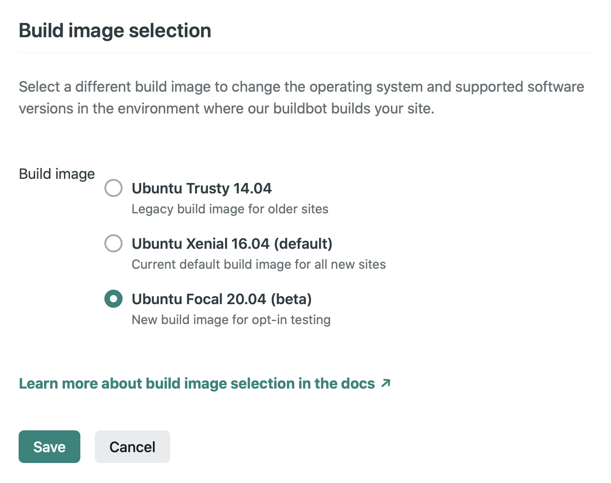

+++
title = "Deploying a Custom Build of Zola to Netlify"
date = 2021-05-30
aliases = ["2021/05-30-custom-zola-build"]

[extra]
comments = true
+++

I've recently started to enjoy building web sites using [Zola](https://getzola.org), a Rust-based static site generator. I'll write more about my decision to use Zola in a future "how I built this" article, but for now I wanted to share with the Zola community some tips on using custom builds of Zola.

<!-- more -->

## The Goal

I have several sites that I have either built or am about to build using Zola (this being one of them!). I uncovered a bug in how the next/previous page links are constructed when using [transparent sections](https://www.getzola.org/documentation/content/section/#front-matter).

The bug (a race condition) often rendered my intended site structure with missing links to next and previous pages.

**Good news:** [The fix was pretty easy](https://github.com/getzola/zola/pull/1456).

**Bad news:** The fix was [not likely to appear in a released version for some time to come](https://zola.discourse.group/t/next-release-schedule/908).

As mentioned in the forum thread, not having access to this bug fix was going to cause me some heartache. Vincent was kind enough in follow-up discussion to suggest a workaround: I could [publish on Netlify with a custom build of Zola](https://zola.discourse.group/t/next-release-schedule/908/4).

This is what I'm doing, both on this site and on several others that I am either building or have recently deployed.

Constructing a build that ran locally was pretty easy; I backported [PR #1456](https://github.com/getzola/zola/pull/1456) onto the existing tagged 0.13.0 release of Zola. The end result is available on [my fork of Zola](https://github.com/scouten/zola/tree/custom) and is tagged in that fork as [release 0.13.0.es2](https://github.com/scouten/zola/releases/tag/v0.13.0.es2). As with anything open-source, you are welcome to use it directly or adapt it for your own purposes.

**2022 Update:** I'm doing the same thing again now to have early access to a [PR I submitted](https://github.com/getzola/zola/pull/1964) that lets me render some of my sites _much_ faster than the current release. You can find [my fork of Zola](https://github.com/scouten/zola/tree/get-term-fn-custom-build) here and the tagged release as [release 0.16.1.es1](https://github.com/scouten/zola/releases/tag/v0.16.1.es1).

Getting that build running on Netlify turned out not to be a particularly simple thing to do.

I am sharing how I did this in hopes that it might make life easier for the next person who walks this path.

## The Machines in Question

My personal development environment is an Intel-based Mac laptop that I haven't (yet) updated to Big Sur.

**2022 Update:** I'm doing the same thing again and now have an M1-based Mac laptop.

Netlify runs Zola (or whatever SSG you are using) in a [custom build image](https://www.netlify.com/blog/2019/03/14/a-more-flexible-build-architecture-with-updated-linux/) that is based on Ubuntu 16.04. Netlify comes prepared to install and run recent released versions of Zola (up to the now-current 0.13.0) via their [`binrc`](https://github.com/netlify/binrc) tool.

## What Didn't Work

If you're eager for answers, feel free to skip ahead to **[What _Did_ Work](#what-did-work)** below.

If you're up for a war story, here are the false starts:

### Compiling the `next` Branch

I started by trying to build the `next` branch as of [commit `22c29fe`](https://github.com/getzola/zola/commit/22c29fe936681b8cad141482dbfc001c43a7f82e), which is when my PR was merged. This failed in two different ways:

* **Cross-compiling.** My current-ish (1.52.0) Rust toolchain failed to build the `x86_64-unknown-linux-gnu` target with this error:

```
error: failed to run custom build command for `ring v0.16.19`
```

* **Building the `next` trunk with my PR merged via the existing Docker container.** I noticed that there was a Docker image in the repo, so I tried to use that to build Zola. I was thinking I could extract the binary and post that to a place Netlify could access. I found that somewhere between 0.13.0 and the merging of my PR, the Docker container stopped working. Running `docker build --progress plain .` on that commit failed with the following message (edited for legibility):

```
#7 97.45 error: could not compile `minify-html`
#7 97.45 
#7 97.45 Caused by:
#7 97.46   process didn't exit successfully: `rustc --crate-name minify_html --edition=2018
           /usr/local/cargo/registry/src/github.com-1ecc6299db9ec823/minify-html-0.4.10/src/lib.rs
           (options omitted)
` (signal: 9, SIGKILL: kill)
#7 97.46 warning: build failed, waiting for other jobs to finish...
#7 119.8 error: build failed
#7 ERROR: executor failed running [/bin/sh -c cargo build --release --target x86_64-unknown-linux-gnu]: exit code: 101
------
 > [builder 5/9] RUN cargo build --release --target x86_64-unknown-linux-gnu:
------
executor failed running [/bin/sh -c cargo build --release --target x86_64-unknown-linux-gnu]: exit code: 101
```

### Backporting to 0.13.0

I then gave up on the `next` branch and started building the `custom` branch I mentioned earlier. Again, this is 0.13.0 with a backport of my PR and some yet-to-be discussed tweaks to the build infrastructure.

* **Building via the existing Docker container.** I again used the existing Docker container, this time to build my `custom` branch. This build succeeded, but then failed to deploy into the Netlify environment because of a system library mismatch. I don't have the deploy logs for that handy any more, but i think it was glibc vs MUSL if I recall correctly.

Researching on this build failure led me to the fact that the [default Rust container](https://github.com/rust-lang/docker-rsust/blob/77e77508828ca2da1a9b7582d079b2d77f8b9a1a/1.52.1/buster/Dockerfile) uses Debian and Netlify uses Ubuntu.

So, I started doing major surgery on the Dockerfile with the intent of building Zola directly on Ubuntu and mimicing the build steps in [Zola's Azure pipeline](https://github.com/getzola/zola/blob/master/azure-pipelines.yml) as closely as possible. See [my commit `e19dd2c`](https://github.com/scouten/zola/commit/e19dd2c82178c41c117f15105597cd24c55449e6) for details:

That led to the next few failures:

* **Using `binrc` isn't an option for arbitrary binaries.** I thought, based on my reading of the `binrc` documentation that I could post a release on GitHub and have Netlify download that release.

```
10:11:57 AM: ────────────────────────────────────────────────────────────────
10:11:57 AM:   1. build.command from netlify.toml                            
10:11:57 AM: ────────────────────────────────────────────────────────────────
10:11:57 AM: ​
10:11:57 AM: $ binrc install scouten/zola 0.13.0.es2 && zola build --base-url $DEPLOY_PRIME_URL
10:11:57 AM: zola's version v0.13.0.es2 doesn't match any known constraint, binrc cannot install it
```

I'm not 100% sure, but I read this as saying that `binrc` is configured to only download from pre-approved repos and mine isn't one of them.

So ... back to the `curl` trick as originally suggested by Vincent. Next failure:

* **Building on Ubuntu 16.04 failed.** I don't have a log handy any more, but Rust was unable to generate a viable build when running on 16.04.

* **Building on Ubuntu 20.04 resulted in a binary that wouldn't deploy on Netlify.**

```
8:42:31 PM: $ curl -sL https://github.com/scouten/zola/releases/download/v0.13.0%2Bes1/zola -o ./zola && chmod +x ./zola && ./zola build --base-url $DEPLOY_PRIME_URL
8:42:32 PM: ./zola: /lib/x86_64-linux-gnu/libm.so.6: version `GLIBC_2.27' not found (required by ./zola)
```

This appears to be documented in the Rust world as follows:

* [Rust binaries require too-recent glibc.](https://github.com/rust-lang/rust/issues/57497)
* [Rust minimum-supported glibc.](https://github.com/rust-lang/libc/issues/1412)

Further reading led me to [Netlify's build image selection panel](https://docs.netlify.com/configure-builds/get-started/#build-image-selection). There, waiting for me, was a button that I could click to switch to deploying using Ubuntu 20.04.

And that leads me to …

## What _Did_ Work

So, having eliminated the possibilities above, I'll summarize the steps that ultimately did work for me: 🎉 

### Custom Build of Zola

I started from the tagged 0.13.0 release of Zola and added just the bug fix I wanted. This build is in [the `custom` branch of my fork of Zola](https://github.com/scouten/zola/tree/custom).

### Custom Docker Build

In the above branch, I made [changes to the Dockerfile](https://github.com/scouten/zola/commit/e19dd2c82178c41c117f15105597cd24c55449e6) to allow me to generate a version of Zola that can deploy on Netlify.

This Dockerfile differs from the one in 0.13.0 as follows:

* It starts from the exact (newer, non-default) OS release used by Netlify, Ubuntu 20.04.
* It adds the Rust build tools in essentially the same fashion as the official Rust build image.
* It builds the release target, but does not `dockerize` it.
* It packages a .tar.gz file such that I can subsequently shell into the Docker image and extract that file.

As of this writing, I don't plan to submit this branch as a PR to Zola because the bug fix PR has already been accepted for the next major version of Zola and the Dockerfile changes serve a different purpose than the original Docker image. (Mine isn't a deployment container, but rather a build vehicle.)

**2022 Update:** Run the following set of commands to generate the Zola build that you will reference later:

```sh
$ docker build --platform linux/amd64 .
$ export container_id=$(docker create --platform linux/amd64 image_id)  # substitute image_id from docker build
$ docker cp $container_id:/release/zola.tar.gz zola.tar.gz
```

The `--platform linux/amd64` tags are necessary if, like me, you are running on an ARM (in my case, Apple M1) host; this will cause Docker to run the container in x86 emulation mode rather than an ARM version of Linux. You can remove those flags if running on a native Intel host.

You should now have a `.tar.gz` file in your local host that you can post to whatever public URL you wish to use.

### Change Netlify Build Image

In the Netlify control panel for my site (**Site page > Site settings > Build & deploy > Continuous deployment > Build image selection > Edit settings**), I changed the choice of image to "Ubuntu Focal 20.04."



**2022 Update:** Ubuntu 20.04 is now the default for new Netlify sites, so this step may no longer be necessary.

### Change `netlify.toml`

One last change, and I made that using [Netlify's file-based configuration](https://docs.netlify.com/configure-builds/file-based-configuration/), also known as `netlify.toml`. Here is the `netlify.toml` file for this site:

```toml
[build]
publish = "public"
command = "curl -sL https://github.com/scouten/zola/releases/download/v0.13.0.es2/zola-v0.13.0.es2-unknown-linux-gnu.tar.gz | tar zxv && chmod +x ./zola && ./zola build"

[context.deploy-preview]
command = "curl -sL https://github.com/scouten/zola/releases/download/v0.13.0.es2/zola-v0.13.0.es2-unknown-linux-gnu.tar.gz | tar zxv && chmod +x ./zola && ./zola build --base-url $DEPLOY_PRIME_URL"
```

What's important here are the `build.command` and `context.deploy-preview.command` entries, which download the custom build, extract it from the tarball, and then use it to render the site content. (I've chosen to host the custom build as a GitHub release, but it appears you could use any publicly-accessible location that is convenient to you.)
